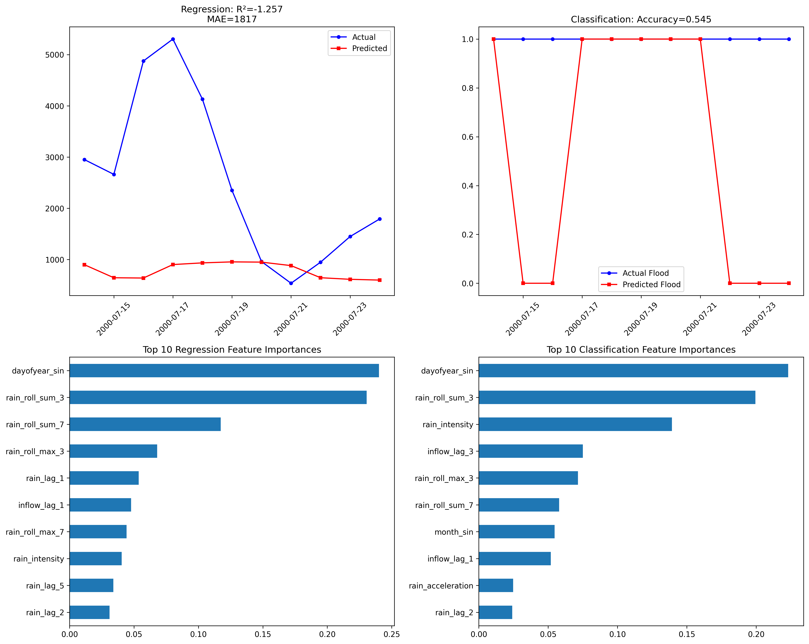
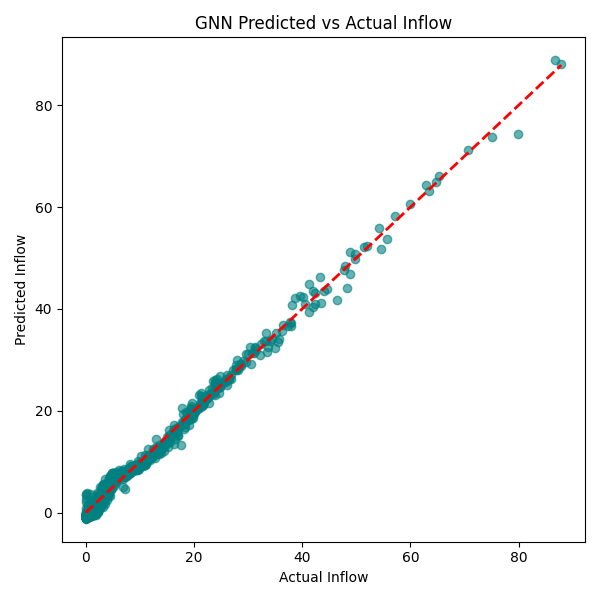

# **🌧️Spatio-Temporal Flood Forecasting using Graph Neural Networks**

#### Next-Day River Inflow Prediction (+1 Day Horizon)
#### By Simhadri Praveena

## **🔍 Objective**
Flood prediction is a major climate-risk challenge globally.
This project builds a spatio-temporal ML pipeline to predict next-day river inflow using:

* ✔ Graph Neural Networks (GNNs) for spatial-temporal learning
* ✔ RandomForest baseline for benchmarking
* ✔ Interactive Streamlit dashboard
* ✔ Real rainfall geospatial grid data

Forecasting horizon: +1 day ahead inflow

Data granularity: Latitude × Longitude rainfall grid per day

## **🗂️ Project Structure**
```commandline
flood_graph/
├── data/
│   └── newflood.xlsx                 # Original raw dataset
│
├── flood_results/                    # Only RandomForest performance here
│   ├── features.csv
│   ├── metrics.json
│   ├── rf_classifier.pkl
│   ├── rf_regressor.pkl
│   └── rf_results.png
│
├── models/                           # GNN artifacts + plots
│   ├── best_gcn_reg_improved.pt
│   ├── dashboard_metrics.json
│   ├── processed_data.npy
│   ├── scaler.npy
│   ├── split_indices.npy
│   ├── test_predictions.npy
│   ├── gnn_actual_vs_pred.png
│   └── gnn_residuals.png
│
├── notebooks/
│   ├── 01_EDA_and_preprocessing.ipynb
│   ├── 02_GNN_training_evaluation.ipynb
│   ├── processed_long_rainfall_v2.csv
│   └── demo/
│       └── sample_dataset_v2.npy      # Graph-ready dataset sample
│
├── scripts/
│   └── run_baseline.py                # RandomForest baseline pipeline
│
├── dashboard/
│   └── app.py                         # Streamlit dashboard
│
├── src/
│   ├── __init__.py
│   ├── data_loader.py
│   ├── graph_builder.py
│   ├── model.py
│   ├── train.py
│   ├── evaluate.py
│   └── utils.py
│
├── requirements.txt
└── README.md
```

## **📊 Dataset Description**
data/newflood.xlsx contains two sheets:

#### **1️⃣ Rainfall Grid (Sheet 1)**
Represents spatio-temporal rainfall over a geographic grid.

| Row / Column    | Meaning                         |
| --------------- | ------------------------------- |
| 1st Row         | **Latitude** values             |
| 2nd Row         | **Longitude** values            |
| Row 3 onward    | Daily rainfall intensity grid   |
| First 3 columns | `Year`, `Month`, `Day` metadata |

Each cell (lat, lon) corresponds to rainfall intensity (mm/day) at that location on that date.

📌 Converts into graph node features for GNN modeling.

#### **2️⃣ Inflow Data (Sheet 2)**
Contains target hydrological measurements.

| Column            | Meaning                                        |
| ----------------- | ---------------------------------------------- |
| `Date`            | Daily record                                   |
| `Inflow (cumecs)` | River inflow volume in cubic meters per second |

📌 Used for supervised learning and correlation with rainfall patterns.

### 🧩 Dataset Fusion
* Rainfall grid (Sheet 1) → Independent variables
* Inflow data (Sheet 2) → Target variable
* Merged based on date matching
* Graph created using rainfall spatial adjacency + temporal continuity
## **🧠 Key Technologies**
| Category             | Tools                                             |
| -------------------- | ------------------------------------------------- |
| ML & GNN             | PyTorch, PyTorch Geometric, RandomForestRegressor |
| Data & Spatial       | Pandas, NumPy, Geo Grid Aggregation               |
| Visualization        | Matplotlib, Streamlit                             |
| Software Engineering | Modular pipeline, Notebook reproducibility        |
| Version Control      | Git, GitHub PR workflow                           |

## **📈 Model Performance**
#### 🟦 RandomForest Baseline (Regression & Classification)
| Task               | Metric    | Score       |
| ------------------ | --------- | ----------- |
| **Regression**     | R²        | **-1.2567** |
|                    | MAE       | **1817.28** |
|                    | RMSE      | **2337.76** |
| **Classification** | Accuracy  | **0.545**   |
|                    | Precision | **1.00**    |
|                    | Recall    | **0.545**   |


#### 🟩 GNN Model (Graph Neural Network)
| Metric                  | Score         |
| ----------------------- | ------------- |
| R²                      | **0.9921**    |
| MAE                     | **0.9466 mm** |
| RMSE                    | **1.1591 mm** |
| Improvement vs Baseline | **+91.1%**    |
| R² Delta                | **↑ +99.2%**  |
| Test Samples            | 885           |
| Baseline RMSE           | 13.0087 mm    |

The GNN demonstrates massive improvement over the RandomForest baseline, proving spatial-temporal modeling is highly effective.

## **📊 Metrics Visualization: RandomForest vs GNN**
### 1️⃣ RandomForest



### 2️⃣ GNN Predicted vs Actual Inflow


### 3️⃣ Performance Summary Table
| Metric | RandomForest | GNN       | Improvement |
| ------ | ------------ | --------- | ----------- |
| R²     | -1.257       | 0.9921    | ↑ 99.2%     |
| MAE    | 1817.28 mm   | 0.9466 mm | ↓ 99.95%    |
| RMSE   | 2337.76 mm   | 1.1591 mm | ↓ 99.95%    |

## **▶️ How to Run**
### 1️⃣ Setup Environment
`conda env create -f environment.yml`

`conda activate flood-gnn`

### 2️⃣ Place Dataset
`data/newflood.xlsx`

### 3️⃣ Run Notebooks (EDA & preprocessing)
`jupyter notebook notebooks/01_EDA_and_preprocessing.ipynb`

`jupyter notebook notebooks/02_GNN_training_evaluation.ipynb`

### 4️⃣ Run Baseline Model

`python scripts/run_baseline.py`

### 5️⃣ Run GNN Training & Evaluation

`python src/train.py`

`python src/evaluate.py`

### 6️⃣ Run Streamlit Dashboard

`streamlit run dashboard/app.py`

## **🌐 Streamlit Advanced UI**
Features:
* ✔ Explore rainfall patterns
* ✔ View baseline and GNN metrics
* ✔ Forecast next-day inflow predictions
* ✔ Designed for multi-day GNN expansion

# Flood Graph Streamlit App
[](https://floodgraph-gkrxwt2uitmrdilfh5dhav.streamlit.app/)

## **🧬 Graph Intelligence Approach**
* Spatial edges: nearest neighbors on the same day
* Temporal edges: same grid cell across days
* Node features: rainfall intensity
* Target: next-day inflow

This allows modeling rainfall → runoff → inflow causal chain.

## 🏆 Why This Project Matters
Flood forecasting is essential for:

* Disaster prevention
* Dam operation safety
* Climate change adaptation
* Urban planning & hydrology risk assessment

This project demonstrates:
* ✔ Strong ML & GNN modeling
* ✔ Data engineering & visualization skills
* ✔ Research + Product mindset

## 🚀 Future Roadmap
| Feature                             | Status     |
| ----------------------------------- | ---------- |
| Multi-step prediction (+3, +5 days) | 🔄 Planned |
| Graph Attention Networks (GAT)      | 🔄 Planned |
| Geo-map rainfall visualization      | 🔄 Planned |
| Cloud deployment (AWS/GCP)          | 🔄 Planned |

## 👩‍💻 Author

* Simhadri Praveena
* Software Development Engineer (SDE) — BlueFlag Security
* Department of Computer Science and Engineering
* Indian Institute of Technology (IIT) Kharagpur

* Research Interests: Machine Learning, Graph Neural Networks, Data Science, Climate AI

